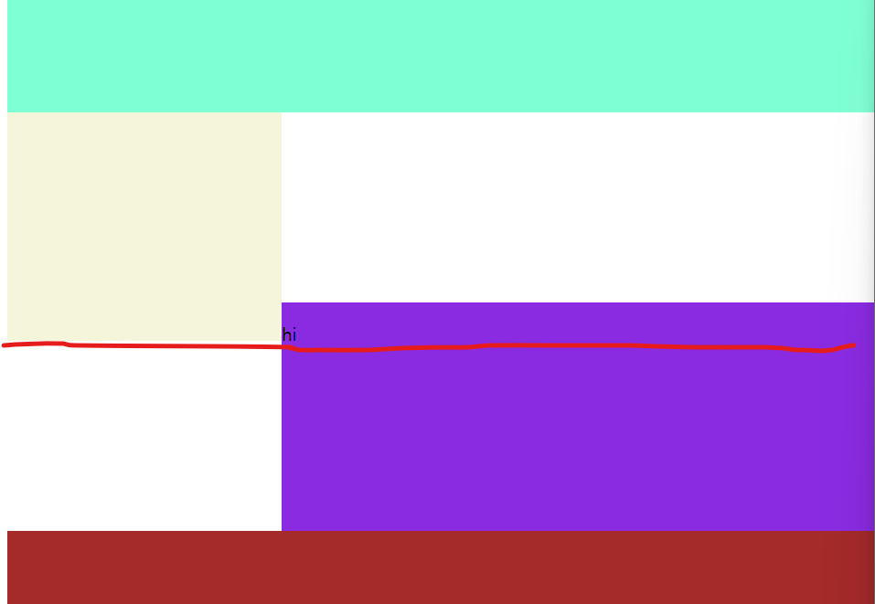

## HTML/CSS


* HTML : markup Language
  * Markup Language : 자료의 구조를 표현하기 위한 언어
    									자료를 어디에 어떻게 배치할지 결정
  
* `<p></p>` : p태그 (paragraph, 본문)

* `<span></span>`: 글자를 감쌀수 있는 의미 없는 태그 (일부 글자에 스타일 or class 줄 때)

* `<h1></h1>`: h태그 (heading, h1 ~ h6)

* `<ul>, <ol>, <li>`: unordered, ordered(자동번호), list item 태그

* 1. 모든 요소는 tag안에 넣을 것
  2. 일부 tag는 속성 가짐
  3. 태그 안에 태그 가능
  
* 이미지 가운데 정렬하는 style
  * display: block; 
  * margin-left: auto; 
  * margin-right: auto;
  
* 자간 간격 조절하는 style                     !!!!!!!!!!!!!
  * letter-spacing
  
* 선택자(selector)우선 순위 (스타일이 겹칠 경우)
  1. 인라인 스타일 (태그에 직접 작성 ex:`<p style=""></p>`)
  2. id
  3. class
  4. tag
  
* float를 앞에 썼고 다음 div쓸꺼면

  * float요소들 뒤에 오는 첫 요소 style에
    ``` css
    .class {
        clear: both;
    }
    ```

    주면 해결됨
    clear: left or clear: right 두개가 있는데 
    둘 다 해결하는것이 both

* display

  * `display: block` : 한 행을 전부 차지

  * `display: inline-block` : 내 크기만큼 차지

    * (div 박스 끼리 나란히 놓을 경우 사이에 줄바꿈 or 공백 모두 제거해야함)
      ex:

      ```html
      <div class="left">/div><div class="right">/div>
      ```

    * 왼쪽박스 30%, 오른쪽박스 70%처럼 딱 맞을 때 나란히 한 행에 넣는 3가지

      1. 위의 방법
      2. float
      3. 공백 제거 안하고 font size를 0으로 하기

    * 그러나 1번 방법으로 한 후 right box에 글자 적을 경우 layout 깨짐
      !!! 원인 : html에서 글자를 쓸 경우 baseline(공책의 밑줄 역할)이 존재하는데
      이 baseline이 존재할 경우 옆에 있는 inline block 요소들이 발작을 일으킴
      옆에 있는 inline block요소들이 자신들이 글자인 줄 알고 옆에 있는 baseline
      선 위에서부터 시작하려고 함
      
      해결방법 : 글자 쓴 옆 inline block 요소에
      vertical-align: top; 
      작성해주기
      
      

* ㅇ

