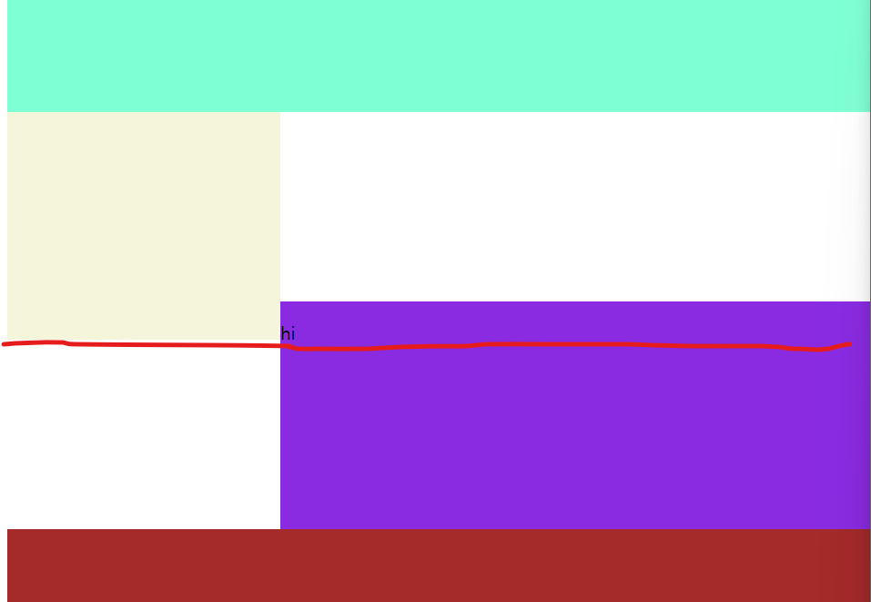

## HTML/CSS part 1


* HTML : markup Language
  * Markup Language : 자료의 구조를 표현하기 위한 언어
    									자료를 어디에 어떻게 배치할지 결정

  
  
* `<p></p>` : p태그 (paragraph, 본문)


* `<span></span>`: 글자를 감쌀수 있는 의미 없는 태그 (일부 글자에 스타일 or class 줄 때)


* `<h1></h1>`: h태그 (heading, h1 ~ h6)


* `<ul>, <ol>, <li>`: unordered, ordered(자동번호), list item 태그


* 1. 모든 요소는 tag안에 넣을 것
  2. 일부 tag는 속성 가짐
  3. 태그 안에 태그 가능


* 이미지 가운데 정렬하는 style
  * display: block; 
  * margin-left: auto; 
  * margin-right: auto;

  

* letter-spacing                   !!!!!!!!!!!!!
  * 자간 간격 조절하는 style  

  

* 선택자(selector)우선 순위 (스타일이 겹칠 경우)
  1. 인라인 스타일 (태그에 직접 작성 ex:`<p style=""></p>`)
  2. id
  3. class
  4. tag

  

* float를 앞에 썼고 다음 div쓸꺼면

  * float요소들 뒤에 오는 첫 요소 style에
    ``` css
    .class {
        clear: both;
    }
    ```

    주면 해결됨
    clear: left or clear: right 두개가 있는데 
    둘 다 해결하는것이 both

  

* display

  * `display: block` : 한 행을 전부 차지

  * `display: inline-block` : 내 크기만큼 차지

    * (div 박스 끼리 나란히 놓을 경우 사이에 줄바꿈 or 공백 모두 제거해야함)
      ex:

      ```html
      <div class="left">/div><div class="right">/div>
      ```

    * 왼쪽박스 30%, 오른쪽박스 70%처럼 딱 맞을 때 나란히 한 행에 넣는 3가지

      1. 위의 방법
      2. float
      3. 공백 제거 안하고 font size를 0으로 하기

    * 그러나 1번 방법으로 한 후 right box에 글자 적을 경우 layout 깨짐
      !!! 원인 : html에서 글자를 쓸 경우 baseline(공책의 밑줄 역할)이 존재하는데
      이 baseline이 존재할 경우 옆에 있는 inline block 요소들이 발작을 일으킴
      옆에 있는 inline block요소들이 자신들이 글자인 줄 알고 옆에 있는 baseline
      선 위에서부터 시작하려고 함
      
      해결방법 : 글자 쓴 옆 inline block 요소에
      vertical-align: top; 
      작성해주기
      
      

  

* .navbar li {
  } : navbar class 밑에 있는 모든 li '자손'

* .navbar > li {
  } : navbar class 밑에 있는 직계 li '자식'


* a 태그 밑줄 없애기 : text-decoration: none;

* a 태그

  * 사용할 수 있는 종류 아래와 같이 4가지 이며
    css에 선언하게 된다면 반드시 이 순서대로 작성할 것
  * a:link		해당 링크를 방문하기 전 상태
  * a:visited   방문한 뒤 상태
  * a:hover     마우스 올렸을 때
  * a:active     클릭했을 때

  

* background-image: url(../shoes.jpg);
  해당 요소가 차지하는 배경에 이미지 넣기


* background-size: 100%;
  배경 이미지 사이즈 조절
  이 때 width를 100%, height: 200px과 같이 줄 경우
  높이는 200px로 고정된 상태로 좌우 너비에 따라 사진 크기가 변하는데
  이때 좌우 너비가 많이 줄어들면 사진이 자동으로 반복됨


* 이 때 background-repeat: no-repeat; 를 통해 위와 같은 문제 해결 가능
  하지만 아래 반복되어 나타나던 자리만큼 칸은 차지


* 이 때 background-size: cover / contain 을 통해 해결 가능

  * cover : 배경 잘려도 상관 없으니 배경으로 공간 꽉 채워라
  * contain : 나 못채워도 상관 없으니 배경사진 잘리면 안된다

  

* background-position: center;

  * 기본적으로 배경사진의 왼쪽부터 나타나게 되나
    위와 같은 속성을 통해 중앙부터 혹은 오른쪽부터 조절 가능

  

* filter: 속성내용

  * 해당 요소에 보정 효과 주기 (밝기, 블러처리, 채도 등)
  * 단 해당요소 안에 글씨, 버튼 등이 같이 있으면 모두 보정효과 받음
    따라서 이미지에만 적용할 수 있도록 주의할 것

  

* margin collapse (마진 상쇄)

  * 여러 블록의 상하 여백은 경우에 따라 제일 큰 여백의 크기를 가진
    단일 여백으로 결합(상쇄) 된다. 이를 여백상쇄 라고 한다
    아래와 같은 세 가지 상황에 발생
    1. 인접 형제
    2. 부모와 자손을 분리하는 컨텐츠가 없을 때
    3. 빈 블록
  * 해결 방법은 인위적으로 두 요소의 테두리를 분리시키면 됨 (ex: padding)

  

* `<body>` 태그에는 기본적으로 margin이 있다.
  따라서 화면에 꽉 채우고 싶은 경우
  `<body style="margin: 0px;">`과 같이 작성하면 된다.


* 요소의 좌표 이동

  1. position 부여 (부여하는 순간 원래 자신의 위치만 차지하고
     						이동한 위치의 실질적인 공간차지 x -> 붕 뜸)
     * position 종류
       1. relative: 원래 자기자신의 위치 기준
       2. fixed: 화면 기준으로 고정 (navbar, footer)
       3. absolute: 내 부모 태그가 기준(단, 부모가 relative여야 함)
          absolute 가운데 정렬하기
          left: 0; right: 0; margin: auto; width ~~px;
       
       

* width, content, padding, border

  * width는 content의 영역이지 padding과 border는 이 밖의 영역이다.
  * 따라서 width를 padding, border를 포함하여 설정해주고 싶을 때는
    box-sizing: border-box; 를 줘야 한다.

  

* 보통 css파일을 만들고 난 후 아래와 같이 코드를 작성하고 시작함
  ```css
  div {
      box-sizing: border-box;
  }
  
  body {
      margin: 0px;
  }
  ```

  숙련자들은 브라우저 호환성 이슈를 해결하기 위한 클래스들 부터 작성하고 시작함


* selector 문법 (조건)
  ```css
  input[type=text] {
      ~~~
  }
  ```

  위와 같이 작성하면 type이 text인 input에만 style이 적용됨

  

* selector 문법 (여러개 동시 선택 가능)

  ```css
  div, input, textarea {
      box-sizing: border-box;
  }
  ```

  위처럼 여러개의 selector 동시에 스타일링 가능

  

* label 태그

  ```html
  <input id='sub' type='checkbox'>
  <label for='sub'>Subscribe</label>
  ```

  위와 같이 input의 id와 label의 for을 맞춰주면
  'Subscribe' 글자를 클릭해도 checkbox가 클릭될 수 있음


- table 태그

  ```html
  <table>
      <tr>
      	<td></td>
          <td></td>
          <td></td>
      </tr>
  </table>
  ```

  table : 표

  tr : 가로 행

  td : 세로 열 (th : 제목용 세로 열)

  제목 행은 `<thead>` 안에
  일반 행은 `<tbody>` 안에 
  넣으면 좋음
  기능상 차이는 없고 코드 가독성을 위한 분류

​		`<table>` 태그는 기본적으로 틈이 존재하는데 
​		이를 없애려면 border-collapse: collapse;
​		스타일을 주면 해결

​		셀 안의 요소 상하정렬
​		vertical-align: top / middle / bottom  (테이블은 이 3개만 가능, 다른곳에서는 더 많은 옵션 가능)
​		vertical-align은 inline/inline-block 요소들이 나란히 있을 때
​		이들을 세로정렬 할 때 씀


- nth-child

  - 여러 요소를 찾은 다음 원하는 n번째 요소에만 스타일을 주는 방법

  - ```css
    .parent child:nth-child(2) {
        ~~~
    }
    parent의 자식인 child 중 두 번째 child에만 적용
    
    .asd efg:nth-child(even) {
        ~~~
    }
    asd의 자식인 efg들 중 짝수번째 efg만 스타일 적용
    
    .parent child:nth-child(3n+1) {
        ~~~
    }
    4, 7, 10 ~~
    ```


- pseudo-class : 여러 상태에 따른 스타일 지정
  반드시 아래의 순서대로 적용할 것

  - hover
  - focus
  - active

  이 외에도 많음
  ```css
  :any-link /*방문 전, 방문 후 링크 한번에 선택할 때*/
  :playing /*동영상, 음성이 재생중일 때*/
  :paused /*동영상, 음성이 정지시*/
  :autofill /*input의 자동채우기 스타일*/
  :disabled /*disabled된 요소 스타일*/
  :checked /*체크박스나 라디오버튼 체크되었을 때*/
  :blank /*input이 비었을 때*/
  :valid /*이메일 input 등에 이메일 형식이 맞을 경우*/
  :invalid /*이메일 input 등에 이메일 형식이 맞지 않을 경우*/
  :required /*필수로 입력해야할 input의 스타일*/
  :nth-child(n) /*n번째 자식 선택*/
  :first-child /*첫째 자식 선택*/
  :last-child /*마지막 자식 선택*/
  ```

  
