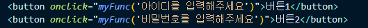

## JS Part 1

### 1. UI 만드는 step

1. HTML/CSS로 미리 디자인
2. 필요할 때 보여달라는 코드 짜기(JS)

### 2. getElementById vs getElementsByClassName

이름에서도 알 수 있듯이 Id는 Element고 Class는 Element"s" 다.
따라서, Id값은 고유하고, Class는 여러개가 들어올 수 있는 것이다.

Id는 해당 요소를 바로 불러오지만,
Class는 배열처럼 동작하는 HTMLCollection 객체를 반환한다.

### 3. onClick 문법 사용

onclick 뒤에 ""로 감싸고 안에 string파라미터는 ''로 감싸기

### 4. toggle

*document**.**getElementById*("list-group").classList.toggle('show');

toggle : 있으면 떼고, 없으면 붙이는 기능

list-group id를 가진 요소에 show라는 class가 있으면 제거하고,
없으면 추가하기

### 5. querySelector vs querySelectorAll

맨위에 나오는 하나만 선택 vs 다 찾아주기

### 6.jQuery

`$` : querySelector

### 7. 애니메이션 만드는 step

1. one-way UI 애니메이션
   1. 시작스타일
   2. 최종스타일
   3. 원할 때 최종스타일로 변하라고 코드짬
   4. 시작 스타일에 transition 추가 (transition: all 1s;)
      css가 변할 때 1초에 걸쳐사 변하게 해줘
