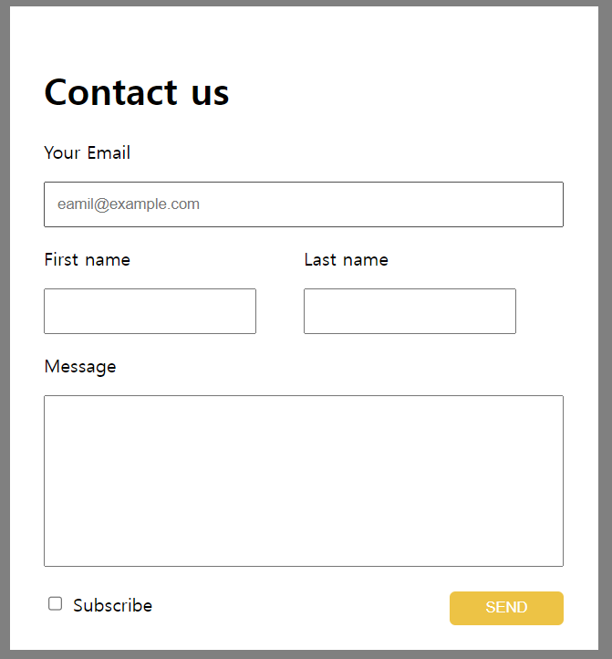
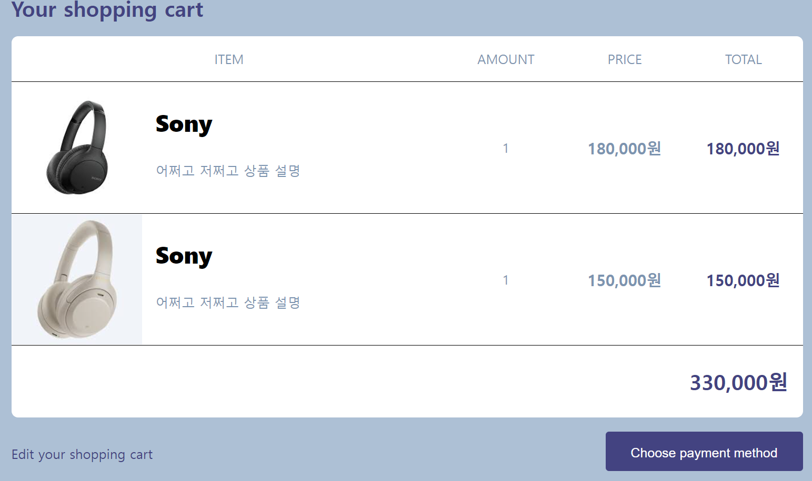

# 코딩애플 학습


## 1. 학습 목표

```
1. SSAFY 교육 이후 이론 정리 및 놓친 부분 학습
2. 백엔드 기초지식 학습
3. JS 심화학습
```

## 2. 목표 로드맵

 	1. HTML/CSS
 		- start : 22-07-19
 	2. JavaScript/jQuery
 	3. React
 		- start : 22-07-21
 	4. JS ES6
 	5. TS
 	6. NodeJS + MongoDB


## 3. 학습 결과물


### HTML&CSS




