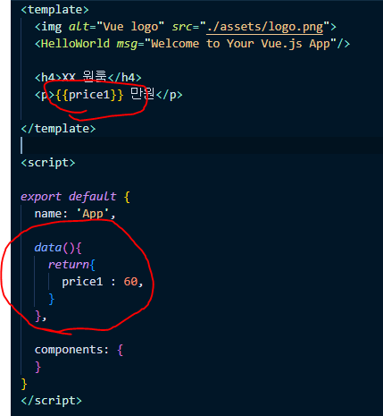

### Vue part1


#### 1. Vue를 사용하는 이유

1. 쉬워서 (개인취향차이, 호불호)
2. right way가 정해져있음
   스타일 통일, 협업에 용이
3. 렌더링 빠름 (ms 단위, 체감 거의 불가능)
4. 업데이트 잘됨


#### 2.프로젝트 시작 및 폴더구조

```
npm install -g @vue/cli
```

```
vue create 프로젝트명
```

App.vue : 메인 페이지
깊게는 index.html이 메인 페이지인데 이 index.html안에
App.vue를 때려 박았기 때문에 사실상 App.vue가 메인 페이지

1. \<template> : HTML

2. \<script> : JS

3. \<style> : CSS

4. 미리보기는 터미널에
   ```
   npm run serve
   ```

   새로고침 필요 없이 저장 -> 바로 반영

5. node_modules : 프로젝트에 쓰는 라이브러리들

6. src : 소스코드 담는 곳

7. public : html, 기타파일 보관

8. package.json : 라이브러리 버전, 프로젝트 설정 기록 (yarn을 쓴다면 yarn.lock)


#### 2. 데이터 바인딩



!!!!!!! react의 state 와 마찬가지로 데이터가 변경되면 실시간으로 자동 렌더링 됨

HTML 속성(class, style 등)도 데이터바인딩 가능
대신 속성에 데이터를 바인딩 할때는
속성앞에 ':' 붙여주기

```html
<h4 class="red" :style="myStyle">
    블라블라
</h4>

~~~
<script>

export default {
  name: 'App',

  data(){
    return{
      myStyle : 'color : blue',
    }
  },

  components: {
  }
}
</script>
```


#### 3. v-on = @


#### 4. 함수

scripts 안에 
```
methods : {
	incresase() {
		this.신고수 += 1
	}
},
```

여기에 함수 만들면 됨


#### 5. v-if

```vue
<div v-if="modalState == true">
    
</div>
<div v-else-if="modalState == false">
    
</div>
```

v-if 식이 참일때 만 해당 div가 생성됨

위에 식이 만족하지 않으면
아래 else if문으로 넘어감


#### 6. Component

긴 HTML을 한 단어로 줄일 수 있는 문법

왜써? -> 코드 간결, 재사용, 

1. Component파일 작성
2. import
3. 등록
4. 사용


#### 7. Props 사용 step

1. 데이터보내고
   ```vue
   <Modal : myData="myData" />
   ```

2. 등록하고
   ```vue
   <script>
     export default {
       name : '~~~',
         props : {
             myData : object 
         }
     }
   </script>
   ```

   props에서 변수명 정하고 세미콜론 뒤에 데이터형식 적어줘야함 (틀려도 에러는 안남, 디버깅용)

3. 사용

Tip : 데이터를 위로 전송하는건 까다롭기 때문에
여러 곳에서 사용하는 데이터는 최상위 컴포넌트에 데이터 넣을 것


#### 8. Props로 받은 부모 데이터 변경

`emit`

자식 컴포넌트
```vue
<h4 @click="$emit('openModal', roomData.id)">{{roomData.title}}</h4>
```

부모 컴포넌트
```vue
<ItemList 
    @openModal="modalState = true; itemNum = $event"
    :roomData="rd" 
    v-for="(rd, i) in roomData" 
    :key="i"/>
```

자식 컴포넌트에서 h4를 클릭하면 부모 컴포넌트에 'openModal'이라는 메세지를 보내고
부모 컴포넌트는 openModal이라는 메세지를 받았을 때 뒤에 있는 자바스크립트 코드를 실행

자식 컴포넌트의 openModal 옆에 roomData.id 는 메세지가 아니라 데이터를 보낸 것인데
이 데이터를 부모 컴포넌트에서 사용하려면 사용할 `변수명` = $event 와 같이 적으면 됨


#### 9. input

```vue
<input @change="month = $event.target.value">
<input @input="month = $event.target.value">
<input v-model="month">
```

@change : 입력하고 커서다른데 찍으면 코드 실행
@input : 입력할 때마다 코드 실행

$evnet 는 JS에서 e와 같음
```javascript
요소.addEventListener('click', function(e){
    
})
```


#### 10. watcher

